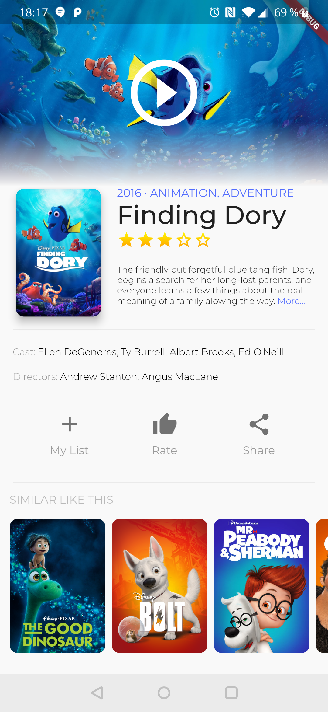

# flutter_movie_ui

This repository is an implementation step-by-step of the following UI

This is based in the Zuva Video Stream design by [vijay verma](https://vijayverma.co/) in [Dribbble](https://dribbble.com/shots/4798990-Zuva-Video-Stream-UI)

This code is intended to be followed with [this presentation](https://docs.google.com/presentation/d/1L-q04XW8IR4Kur9rMUyZsPOBRW_FD2jLWRbzfmWjtA8/edit?usp=sharing)

Check the [project commits](https://github.com/sergiandreplace/flutter_movie_ui/commits/master) to see all steps followed to create this code
